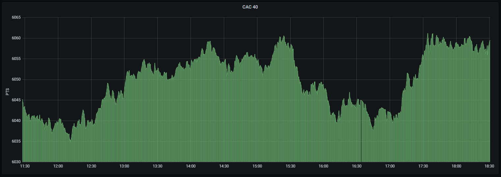

# Web_Scraping

## Objectif

L'objectif de ce projet est d' extraire de la donnée financière, dans notre cas, le cours du CAC40 avec un outil de scraping, enregistrer celle-ci dans une base de donnée afin de pouvoir effectuer de la visualisation graphique. 

Pour ce projet, nous utiliserons docker afin de containariser notre outil de recolte de data, notre base, et Grafana pour la visualisation.

### Scraping

Pour effectuer note scraping, nous utiliserons Selenium. Selenium est un outil d’automatisation de test pour le web. Il permet de créer des “robots” qui naviguent dans des pages webs comme le ferait un vrai utilisateur. Nous l'avons choisi car il est plutôt simple à utiliser, et bien adapté à l'extraction de données. L’avantage c’est que l’on peut donc naviguer sur les pages, remplir des formulaire, cliquer sur des boutons, scroller, parser des pages etc. Selenium est donc un outil qui peut être très intéréssant de savoir utiliser. 

### BDD

Côté base de donnée, nous utiliserons MySQL server qui fera amplement l'affaire au vu du peu de données qui sont extraitent. Idéalement, notre choix se portait sur MongoDB, mais celui-ci n'est malheureusement pas accecible gratuitement depuis Grafana.

### Data-Viz

Pour la visualisation de nos données nous utiliserons Grafana. Celui-ci est directemennt relié à notre base de donnée MySQL qui nous permet une visualisation rapide, bien adapté au data de type TimeSeries et le tout en temps réél.

### Mise en place du projet 

* Afin d'utiliser ce projet, clonez tout d'abord le repository dans un nouveau dossier : 

`git clone https://github.com/PaulSabia/Web_Scraping.git`

* Puis dans le terminal depuis votre dossier :

`docker-compose up -d`

* Enfin, ouvrez votre navigateur et tapez l'adresse `localhost:3000`:

Si vous désirez seulement visualiser la donnée sans utiliser l'outil de scraping : `docker stop scraper-container`
